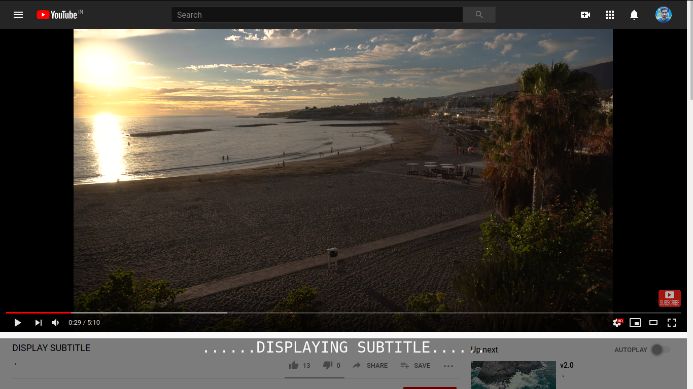

## Youtube Subtitle (v1.0)(old)

* No more support

## Display subtitle (v2.0)

Extension to display subtitle from external 'srt' format file.\
v2.0, improved, dynamic\

---
### Firefox
<h1><code> </b>GET YOUR SUBTITLE<a href="https://addons.mozilla.org/en-US/firefox/addon/displaysubtitle"> HERE </a></b></code></h1>

### Here's what it looks like

\
\

